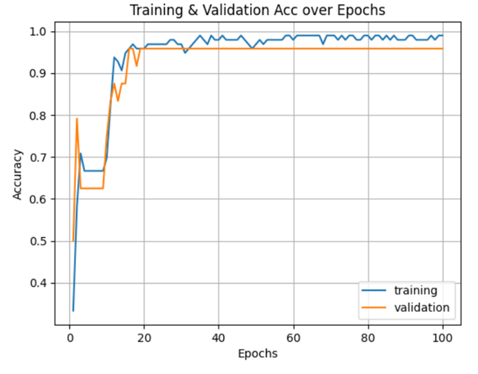

# Pauline0115.github.io

# 💡💡Experiment_1&nbsp;:&nbsp;Hidden Layer
# 1. *_hidden layer formula_1_
🔎(N_s)/((alpha*(N_i+N_o))+(1-alpha)*(N_i_pre)): 
+  Based on the loss function, this formula promotes quicker convergence of the neural network compared to the empirical rule.
+  The model converges around epoch 30
+  Epoch 30, Train Loss: 13439495345.92, Validation Loss: 13723190328.32

# 2. *_hidden layer formula_2_
🔎sqrt_NiNo = math.sqrt(N_i + N_o),  
&nbsp;&nbsp;&nbsp;&nbsp;&nbsp;(N_s)/(alpha*(sqrt_NiNo)): 
+  Based on the loss function, this formula promotes quicker convergence of the neural network compared to the empirical rule and hidden layer formula_1.
+  The model converges around epoch 15
+  Epoch 15, Train Loss: 13389441935.36, Valiation Loss: 13499407528.96
+ 💖 Shortest model training time above all

# 3. *_empirical rule_
🔎(N_s)/(alpha*(N_i+N_o)): 
+  The model converges around epoch 50
+  Epoch 50, Train Loss: 13551826220.8, Validation Loss: 13244403968.0

# 4. *_user defined_
🔎hidden_size1 = 20  # Number of neurons in the first hidden layer 
🔎hidden_size2 = 10  # Number of neurons in the second hidden layer
+  Based on the behavior of the loss function, it is suggested to limit the training epochs to 60 to prevent overfitting. 
+  Epoch 60, Train Loss: 13470077943.04, Validation Loss:12874699617.28
+  ⌛Longest model training time above all 

# 💡💡Experiment_2&nbsp;:&nbsp;Weight Initializer
# 1. *_Kaiming He Initialization_
🔎(N_s)/((alpha*(N_i+N_o))+(1-alpha)*(N_i_pre)): 
+  At the training epoch=23, a relatively stable training accuracy of 95% was achieved; Epoch=23, Train Loss: 0.65, Validation Loss: 0.658, Training Acc: 0.958, Validation Acc: 0.958.
+  By the training epoch=52, a more stable training accuracy of 97% was reached; Epoch 52, Train Loss: 0.6058645248413086, Validation Loss: 0.605, Training Acc: 0.979, Validation Acc: 1.0.

# 2. *_self-defined initializer_
🔎(N_s)/((alpha*(N_i+N_o))+(1-alpha)*(N_i_pre)): 
+  At the training epoch=16, a stable training accuracy of 95% was achieved; Epoch=16, Train Loss: 0.747, Validation Loss: 0.762, Training Acc: 0.958, Validation Acc: 0.958
+  At the training epoch=53, a stable training accuracy of 97% was reached; Epoch=53, Train Loss: 0.588, Validation Loss: 0.628, Training Acc: 0.979, Validation Acc: 0.958
+  At the training epoch=61, a stable training accuracy of 98% was achieved; Epoch=61, Train Loss: 0.585, Validation Loss: 0.621, Training Acc: 0.989, Validation Acc: 0.958
+ 💖 Judging by the criterion of achieving a stable training accuracy of 95%, the Self-defined initializer reached 95% training accuracy at 16 training epochs, faster than He normal.
+  Both reached 97% training accuracy at almost the same number of training epochs.
+ 💖 The Self-defined initializer can achieve a maximum training accuracy of 98%, surpassing the highest 97% achieved by He normal.

