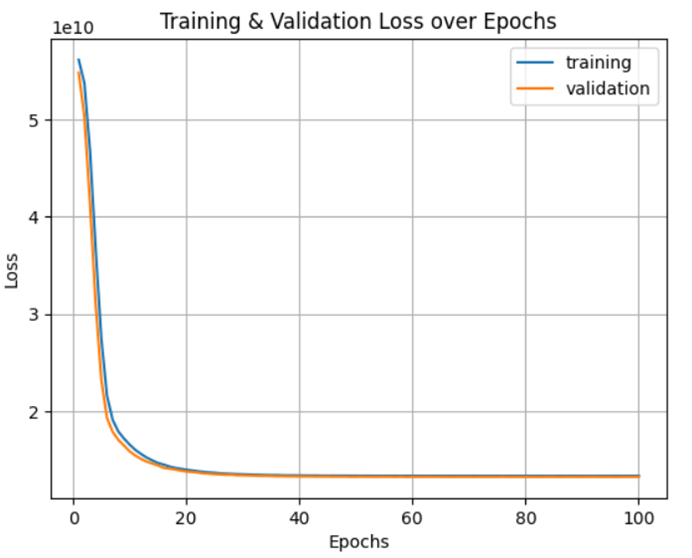
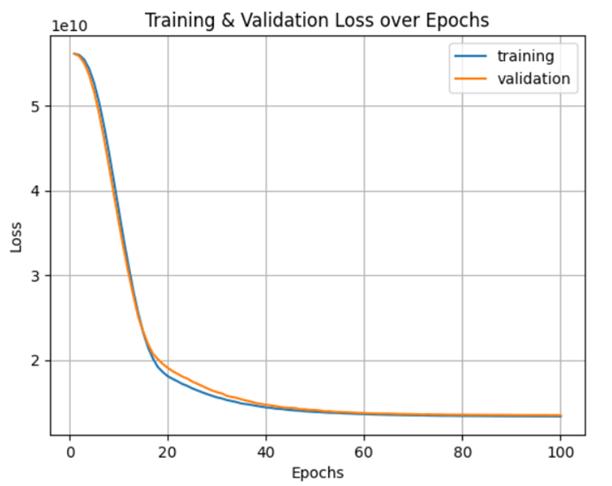

# Pauline0115.github.io
*   `bg_color` - Card's background color *(hex color)* **or** a gradient in the form of *angle,start,end*. Default: `fffefe`
> [!NOTE]\
> Available ranks are S (top 1%), A+ (12.5%), A (25%), A- (37.5%), B+ (50%), B (62.5%), B- (75%), C+ (87.5%) and C (everyone). This ranking scheme is based on the [Japanese academic grading](https://wikipedia.org/wiki/Academic_grading_in_Japan) system. The global percentile is calculated as a weighted sum of percentiles for each statistic (number of commits, pull requests, reviews, issues, stars and followers), based on the cumulative distribution function of the [exponential](https://wikipedia.org/wiki/exponential_distribution) and the [log-normal](https://wikipedia.org/wiki/Log-normal_distribution) distributions. The implementation can be investigated at [src/calculateRank.js](https://github.com/anuraghazra/github-readme-stats/blob/master/src/calculateRank.js). The circle around the rank shows 100 minus the global percentile.

# 💡💡Experiment
# 1. *_hidden layer formula_

# 🔦 :flashlight: 做實驗
# 🔎 做實驗
# 🤯 做實驗
