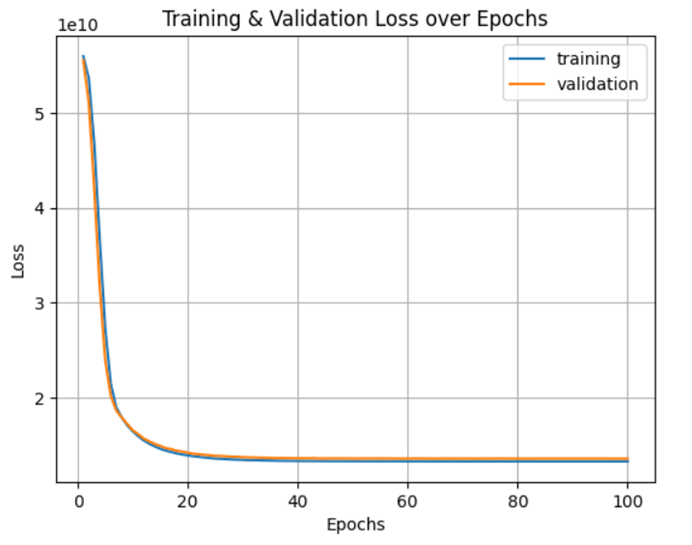
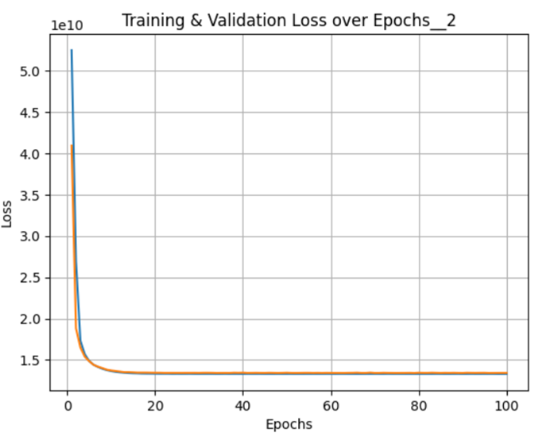

# Pauline0115.github.io

# 💡💡Experiment:hidden layer
# 1. *_hidden layer formula_1_
🔎(N_s)/((alpha*(N_i+N_o))+(1-alpha)*(N_i_pre)): 
+  Based on the loss function, this formula promotes quicker convergence of the neural network compared to the empirical rule.
+  The model converges around epoch 30
+  Epoch 30, Train Loss: 13439495345.92, Validation Loss: 13723190328.32

# 2. *_hidden layer formula_2_
🔎sqrt_NiNo = math.sqrt(N_i + N_o),  
&nbsp;&nbsp;&nbsp;&nbsp;&nbsp;(N_s)/(alpha*(sqrt_NiNo)): 
+  Based on the loss function, this formula promotes quicker convergence of the neural network compared to the empirical rule and hidden layer formula_1.
+  The model converges around epoch 15
+  Epoch 15, Train Loss: 13389441935.36, Valiation Loss: 13499407528.96
+ 💖 Shortest model training time above all

# 3. *_empirical rule_
🔎(N_s)/(alpha*(N_i+N_o)): 
+  The model converges around epoch 50
+  Epoch 50, Train Loss: 13551826220.8, Validation Loss: 13244403968.0

# 4. *_user defined_
🔎hidden_size1 = 20  # Number of neurons in the first hidden layer 
🔎hidden_size2 = 10  # Number of neurons in the second hidden layer
+  Based on the behavior of the loss function, it is suggested to limit the training epochs to 60 to prevent overfitting. 
+  Epoch 60, Train Loss: 13470077943.04, Validation Loss:12874699617.28
+  ⌛Longest model training time above all 

